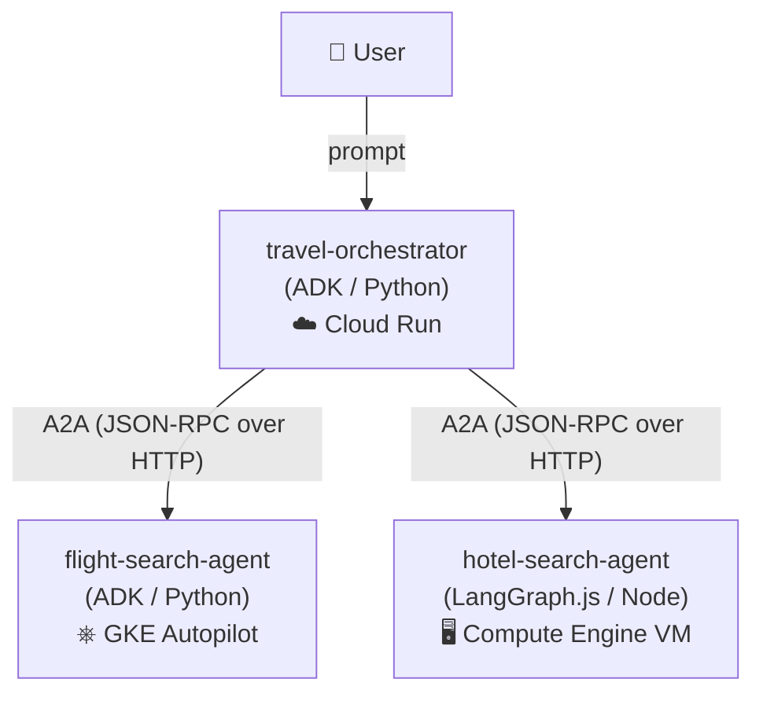

# A2A Cross-Platform Demo — Travel Planner

Three independent agents, three different compute platforms, **two different
agent frameworks**, one shared protocol: **A2A (Agent2Agent)**. None of the
agents care where the others are hosted or what built them — they only need
each other's AgentCard URL.



| Agent | Framework | Platform | Deploy tool |
|---|---|---|---|
| **travel-orchestrator** | ADK (Python) | Cloud Run | `agents-cli deploy` |
| **flight-search-agent** | ADK (Python) | GKE Autopilot | `agents-cli deploy` (Terraform) |
| **hotel-search-agent** | LangGraph.js (Node) | Compute Engine VM | `gcloud` (manual) |

## Repo layout

```
a2a-communication/
├── travel-orchestrator/        # Cloud Run  — root agent, delegates via A2A
├── flight-search-agent/        # GKE        — mock flight search
├── hotel-search-agent/         # Compute Engine VM — mock hotel search (Node)
├── scripts/                    # Local run / test / stop helpers
└── .agents-cli-spec.md         # The agreed demo spec
```

## Prerequisites

- **agents-cli** v1.5+ — `uv tool install google-agents-cli`
- **Node.js** 22+ — for hotel-search-agent
- **gcloud**, **kubectl**, **docker** on PATH
- **Authenticated:**
  ```bash
  agents-cli login -i
  gcloud auth login
  gcloud auth application-default login
  ```
- A **GCP project** with billing enabled (this repo uses `gde-workspace`)

---

## Local development

Install dependencies once per project:

```bash
(cd flight-search-agent && agents-cli install)
(cd hotel-search-agent  && npm install)
(cd travel-orchestrator && agents-cli install)
```

Run all three locally and test end-to-end:

```bash
./scripts/run-local.sh      # starts flight:8001, hotel:8002, orchestrator:8000
./scripts/test-local.sh     # sends a trip-planning prompt to the orchestrator
./scripts/stop-local.sh     # kills all three
```

`run-local.sh` sets `FLIGHT_AGENT_URL=http://localhost:8001` and
`HOTEL_AGENT_URL=http://localhost:8002` for the orchestrator — those are the
only two env vars that change between local and deployed.

Poke a single agent's AgentCard:

```bash
curl http://localhost:8001/a2a/app/.well-known/agent-card.json | jq .
```

---

## Deploying

> **⚠️ Never run these against a real project without confirming with whoever
> owns billing.** All three agents should be in the same region to avoid
> cross-region latency. This repo uses `asia-south1`.

Deploy in this order: **flight → hotel → orchestrator** (the orchestrator
needs both remote URLs before it can be configured).

### Step 1 — flight-search-agent → GKE Autopilot

```bash
cd flight-search-agent
```

**Provision infrastructure** (one-time, ~10–15 min). This is optional — 
`agents-cli deploy` works out of the box with smart defaults. Run `infra` only
if you need a dedicated service account or custom IAM bindings:

```bash
# Preview the Terraform plan
agents-cli infra single-project --project gde-workspace

# Apply when satisfied
agents-cli infra single-project --project gde-workspace --apply
```

**Deploy the agent:**

```bash
agents-cli deploy --no-confirm-project
```

Region and deploy target (`gke`) are read from `agents-cli-manifest.yaml` —
no `--region` flag needed.

**Make the LoadBalancer external.** The scaffolded GKE service defaults to
internal-only. For this demo, patch it to be externally reachable:

```bash
kubectl patch svc flight-search-agent -n flight-search-agent \
  --type=json \
  -p='[{"op":"remove","path":"/metadata/annotations/cloud.google.com~1load-balancer-type"}]'
```

> The `~1` is JSON Patch's escape for `/` in the annotation key.

**Grab the external IP** (wait until `EXTERNAL-IP` is no longer `<pending>`):

```bash
kubectl get svc flight-search-agent -n flight-search-agent -w
```

Note this IP — it becomes the `FLIGHT_AGENT_URL` for the orchestrator.

### Step 2 — hotel-search-agent → Compute Engine VM

This one deliberately skips all `agents-cli` tooling — it's a plain Node
container on a bare VM, proving A2A doesn't need a managed platform or even
the same language as the other agents.

```bash
cd hotel-search-agent
```

**Build and push the container image:**

```bash
gcloud builds submit --tag gcr.io/gde-workspace/hotel-search-agent \
  --machine-type=e2-highcpu-8 .
```

> If Cloud Build still fails, build and push locally instead:
> ```bash
> docker build -t gcr.io/gde-workspace/hotel-search-agent .
> docker push gcr.io/gde-workspace/hotel-search-agent
> ```
> (Run `gcloud auth configure-docker` first if you haven't.)

**Create the VM:**

```bash
gcloud compute instances create-with-container hotel-search-agent-vm \
  --project=gde-workspace \
  --zone=asia-south1-a \
  --machine-type=e2-small \
  --container-image=gcr.io/gde-workspace/hotel-search-agent \
  --container-env=GOOGLE_CLOUD_PROJECT=gde-workspace,GOOGLE_CLOUD_LOCATION=global \
  --tags=http-server
```

**Open port 8080:**

```bash
gcloud compute firewall-rules create allow-hotel-agent-8080 \
  --allow=tcp:8080 --target-tags=http-server --source-ranges=0.0.0.0/0
```

**Set APP_URL** (the AgentCard bakes this URL into `supportedInterfaces` so
follow-up A2A calls reach the right address):

```bash
VM_IP=$(gcloud compute instances describe hotel-search-agent-vm \
  --zone=asia-south1-a \
  --format='get(networkInterfaces[0].accessConfigs[0].natIP)')

gcloud compute instances update-container hotel-search-agent-vm \
  --zone=asia-south1-a \
  --container-env=GOOGLE_CLOUD_PROJECT=gde-workspace,GOOGLE_CLOUD_LOCATION=global,APP_URL=http://${VM_IP}:8080
```

Note `http://<VM_IP>:8080` — this becomes `HOTEL_AGENT_URL` for the orchestrator.

### Step 3 — travel-orchestrator → Cloud Run

Deploy last, once you have both remote URLs:

```bash
cd travel-orchestrator

agents-cli deploy --no-confirm-project \
  --update-env-vars "FLIGHT_AGENT_URL=http://<GKE_IP>:8080,HOTEL_AGENT_URL=http://<VM_IP>:8080"
```

Replace `<GKE_IP>` and `<VM_IP>` with the actual IPs from Steps 1 and 2.

---

## Running the deployed demo

```bash
agents-cli run --url <orchestrator-cloud-run-url> --mode a2a \
  "Plan a trip to Austin, Oct 3-5, flying out of SFO"
```

The orchestrator on **Cloud Run** calls a Kubernetes pod on **GKE** and a bare
VM on **Compute Engine** over plain HTTP + JSON-RPC. The hotel agent is
Node/LangGraph.js, the other two are Python/ADK, and the wire protocol doesn't
care. That's A2A.

---

## Tearing down

### flight-search-agent (GKE — Terraform)

```bash
cd flight-search-agent/deployment/terraform/single-project
terraform destroy -var-file=vars/env.tfvars
```

### hotel-search-agent (Compute Engine — manual)

```bash
gcloud compute instances delete hotel-search-agent-vm --zone=asia-south1-a
gcloud compute firewall-rules delete allow-hotel-agent-8080
gcloud container images delete gcr.io/gde-workspace/hotel-search-agent --force-delete-tags
```

### travel-orchestrator (Cloud Run)

```bash
gcloud run services delete travel-orchestrator --region=asia-south1
```

---

## Rebuilding / iterating

- **flight-search-agent** and **travel-orchestrator** follow the standard
  `agents-cli` lifecycle. Run `agents-cli playground` inside either project
  for interactive testing in isolation.
- **hotel-search-agent** is a plain Node project — `npm install`, `npm start`,
  `npm test`. No `agents-cli` involved.

See each project's own `AGENTS.md` and the `google-agents-cli-workflow` skill
for more details.
