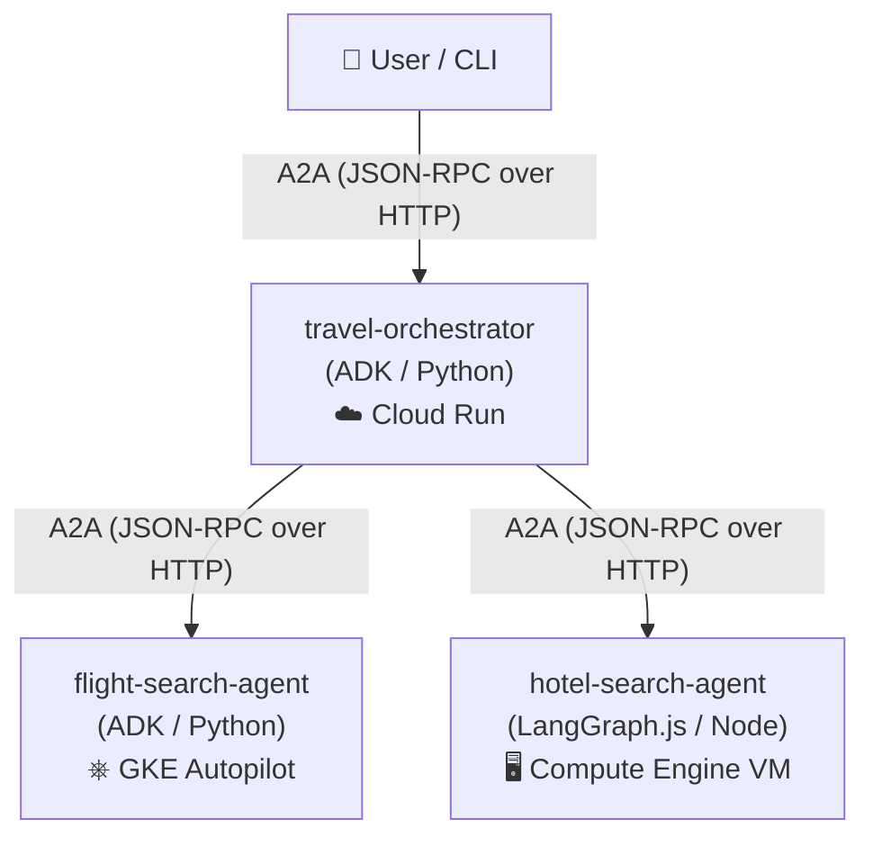

# A2A Cross-Platform Demo — Travel Planner

Three independent agents, three different compute platforms, **two different
agent frameworks**, one shared protocol: **A2A (Agent2Agent)**. None of the
agents care where the others are hosted or what built them — they only need
each other's AgentCard URL.



| Agent | Framework | Platform | Deploy tool | Exposed Port |
|---|---|---|---|---|
| **travel-orchestrator** | ADK (Python) | Cloud Run | `agents-cli deploy` | `8080` (HTTPS) |
| **flight-search-agent** | ADK (Python) | GKE Autopilot | `agents-cli deploy` / `kubectl` | `8080` (HTTP) |
| **hotel-search-agent** | LangGraph.js (Node) | Compute Engine VM (COS) | `gcloud` / deploy script | `8080` (HTTP) |

## Repo layout

```
a2a-communication/
├── travel-orchestrator/        # Cloud Run  — root agent, delegates via A2A
├── flight-search-agent/        # GKE        — mock flight search
├── hotel-search-agent/         # Compute Engine VM — mock hotel search (Node)
├── scripts/
│   ├── deploy-hotel-vm.sh      # Automated COS VM provisioner
│   ├── run-local.sh            # Local run helper (ports 8000, 8001, 8002)
│   ├── test-local.sh           # Local test runner
│   └── stop-local.sh           # Local teardown helper
└── .agents-cli-spec.md         # The agreed demo spec
```

## Prerequisites

- **agents-cli** v1.5+ — `uv tool install google-agents-cli`
- **Node.js** 22+ — for `hotel-search-agent`
- **uv** — Python package manager: `curl -LsSf https://astral.sh/uv/install.sh | sh`
- **gcloud**, **kubectl**, **docker** on `PATH`
- **Authentication:**
  ```bash
  agents-cli login -i
  gcloud auth login
  gcloud auth application-default login
  ```
- A **GCP project** with billing enabled (e.g. `gde-workspace`) and APIs enabled (`run.googleapis.com`, `container.googleapis.com`, `compute.googleapis.com`, `aiplatform.googleapis.com`).

---

## Local development

Install dependencies once per project:

```bash
(cd flight-search-agent && agents-cli install)
(cd hotel-search-agent  && npm install)
(cd travel-orchestrator && agents-cli install)
```

Run all three locally and test end-to-end:

```bash
./scripts/run-local.sh      # starts flight:8001, hotel:8002, orchestrator:8000
./scripts/test-local.sh     # sends a trip-planning prompt to the orchestrator
./scripts/stop-local.sh     # kills all three
```

`run-local.sh` sets `FLIGHT_AGENT_URL=http://localhost:8001` and
`HOTEL_AGENT_URL=http://localhost:8002` for the orchestrator — those are the
only two env vars that change between local and deployed.

Inspect a single agent's AgentCard locally:

```bash
curl http://localhost:8001/a2a/app/.well-known/agent-card.json | jq .
```

---

## Deploying to Google Cloud

> **⚠️ Note on Region & Billing:** All three agents should be in the same region to avoid
> cross-region latency. This demo uses `asia-south1`.

Deploy in this order: **flight → hotel → orchestrator** (the orchestrator
needs both remote URLs before it can be configured).

---

### Step 1 — flight-search-agent → GKE Autopilot

```bash
cd flight-search-agent
```

#### 1. Provision infrastructure (one-time)
Terraform provisions the VPC, GKE Autopilot cluster, and initial Kubernetes namespace/deployment:

```bash
# Preview the Terraform plan
agents-cli infra single-project --project gde-workspace

# Apply infrastructure
agents-cli infra single-project --project gde-workspace --apply
```
*(Requires `gcloud auth application-default login` for Terraform).*

#### 2. Deploy the real flight search container
The initial Terraform apply deploys a placeholder image (`us-docker.pkg.dev/cloudrun/container/hello`). Deploy the real agent:

```bash
# Option A: via agents-cli
agents-cli deploy --no-confirm-project --project gde-workspace

# Option B: direct Cloud Build & kubectl (faster, bypasses Terraform)
gcloud builds submit --project=gde-workspace --tag gcr.io/gde-workspace/flight-search-agent .
kubectl set image deployment/flight-search-agent flight-search-agent=gcr.io/gde-workspace/flight-search-agent -n flight-search-agent
```

#### 3. Grab the external IP & set `APP_URL`
The LoadBalancer is **automatically provisioned as external** because [service.tf](file:///Users/adityajoshi/development/ai-workshops/a2a-communication/flight-search-agent/deployment/terraform/single-project/service.tf#L145) has `annotations = {}` (no manual `kubectl patch` needed).

Wait until `EXTERNAL-IP` is populated, then extract it into a variable:

```bash
# Watch until EXTERNAL-IP is assigned (if newly created)
kubectl get svc flight-search-agent -n flight-search-agent -w

# Extract the external IP into a variable
GKE_IP=$(kubectl get svc flight-search-agent -n flight-search-agent \
  -o jsonpath='{.status.loadBalancer.ingress[0].ip}')

echo "Flight Agent GKE IP: ${GKE_IP}"
```

Set `APP_URL` on the deployment so the agent advertises its public address in its AgentCard rather than `0.0.0.0:8000`:

```bash
kubectl set env deployment/flight-search-agent APP_URL="http://${GKE_IP}:8080" -n flight-search-agent
kubectl rollout status deployment/flight-search-agent -n flight-search-agent
```

Verify the card is healthy:
```bash
curl -s http://${GKE_IP}:8080/a2a/app/.well-known/agent-card.json | jq .
```

---

### Step 2 — hotel-search-agent → Compute Engine VM

This agent is built with **Node.js + LangGraph.js** and deployed to a **Compute Engine VM** running Container-Optimized OS (COS), demonstrating language and framework interoperability.

#### Option A: One-command automated deployment
From the `a2a-communication` root directory, run:

```bash
./scripts/deploy-hotel-vm.sh
```
This script builds the container via Cloud Build, ensures firewall rules, launches the COS VM with self-configuring IP metadata, and prints `HOTEL_AGENT_URL`.

#### Option B: Manual deployment

1. **Build and push the container image:**
   ```bash
   cd hotel-search-agent
   gcloud builds submit --project=gde-workspace \
     --tag gcr.io/gde-workspace/hotel-search-agent \
     --machine-type=e2-highcpu-8 .
   ```

2. **Create the VM instance (Container-Optimized OS):**
   *(Note: The legacy `create-with-container` is deprecated in GCP. Use `cos-stable` with startup script instead).*
   ```bash
   gcloud compute instances create hotel-search-agent-vm \
     --project=gde-workspace \
     --zone=asia-south1-a \
     --machine-type=e2-small \
     --image-family=cos-stable \
     --image-project=cos-cloud \
     --scopes=cloud-platform \
     --tags=http-server \
     --metadata=startup-script='#!/bin/bash
   export HOME=/var/lib/docker
   mkdir -p /var/lib/docker
   docker-credential-gcr configure-docker --registries=gcr.io
   VM_IP=$(curl -s -H "Metadata-Flavor: Google" "http://metadata.google.internal/computeMetadata/v1/instance/network-interfaces/0/access-configs/0/external-ip")
   docker pull gcr.io/gde-workspace/hotel-search-agent
   docker run -d --restart=always \
     --name=hotel-search-agent \
     -p 8080:8080 \
     -e GOOGLE_CLOUD_PROJECT=gde-workspace \
     -e GOOGLE_CLOUD_LOCATION=global \
     -e APP_URL=http://${VM_IP}:8080 \
     gcr.io/gde-workspace/hotel-search-agent'
   ```
   > **Important:** Setting `export HOME=/var/lib/docker` is required because the `/root` filesystem on COS is mounted read-only.

3. **Open firewall port 8080:**
   ```bash
   gcloud compute firewall-rules create allow-hotel-agent-8080 \
     --project=gde-workspace \
     --allow=tcp:8080 \
     --target-tags=http-server \
     --source-ranges=0.0.0.0/0
   ```

4. **Fetch the VM's external IP:**
   ```bash
   VM_IP=$(gcloud compute instances describe hotel-search-agent-vm \
     --project=gde-workspace \
     --zone=asia-south1-a \
     --format='get(networkInterfaces[0].accessConfigs[0].natIP)')

   echo "Hotel Agent IP: ${VM_IP}"
   ```

Verify the card is healthy:
```bash
curl -s http://${VM_IP}:8080/a2a/app/.well-known/agent-card.json | jq .
```

---

### Step 3 — travel-orchestrator → Cloud Run

Deploy last, once you have both `<GKE_IP>` and `<VM_IP>`:

```bash
cd travel-orchestrator

agents-cli deploy --no-confirm-project --project gde-workspace \
  --update-env-vars "FLIGHT_AGENT_URL=http://<GKE_IP>:8080,HOTEL_AGENT_URL=http://<VM_IP>:8080,GOOGLE_GENAI_USE_VERTEXAI=true,GOOGLE_CLOUD_PROJECT=gde-workspace,GOOGLE_CLOUD_LOCATION=global"
```

#### Enable public unauthenticated access
Cloud Run services default to `--no-allow-unauthenticated`. Grant `roles/run.invoker` to `allUsers` for demo access:

```bash
gcloud run services add-iam-policy-binding travel-orchestrator \
  --project=gde-workspace \
  --region=asia-south1 \
  --member="allUsers" \
  --role="roles/run.invoker"
```

Verify the orchestrator card is healthy:
```bash
curl -s https://<orchestrator-cloud-run-url>/a2a/app/.well-known/agent-card.json | jq .
```
You should see `flight_search_agent` and `hotel_search_agent` listed under `skills`.

---

## Running the deployed demo

From `travel-orchestrator/`:

```bash
cd travel-orchestrator

# 1. Combined trip prompt (delegates to both Flight and Hotel agents)
agents-cli run --url https://<orchestrator-cloud-run-url> --mode a2a \
  "Plan a trip to Austin, Oct 3-5, flying out of SFO"

# 2. Flight-only search prompt
agents-cli run --url https://<orchestrator-cloud-run-url> --mode a2a \
  "Find round-trip flights between SFO and Austin for Oct 3-5"

# 3. Hotel-only search prompt
agents-cli run --url https://<orchestrator-cloud-run-url> --mode a2a \
  "Find hotels in Austin for Oct 3-5"
```

The orchestrator on **Cloud Run** calls a Kubernetes pod on **GKE** and a bare
VM on **Compute Engine** over plain HTTP + JSON-RPC. The hotel agent is
Node/LangGraph.js, the other two are Python/ADK, and the wire protocol doesn't
care. That's A2A.

---

## Key Gotchas & Troubleshooting

| Issue | Cause | Fix |
|---|---|---|
| **`Agent card URL must use https, or http on a loopback host`** | ADK's `RemoteA2aAgent` security check blocks plain HTTP for non-localhost URLs | In `travel-orchestrator/app/agent.py`, patch `google.adk.agents.remote_a2a_agent._is_loopback_host = lambda host: True` for direct IP demo targets. |
| **`HTTP 403 Forbidden` on Cloud Run URL** | Cloud Run defaults to private authentication | Run `gcloud run services add-iam-policy-binding travel-orchestrator --member="allUsers" --role="roles/run.invoker"`. |
| **`ValueError: No API key was provided`** | `google-genai` SDK defaults to Google AI Studio if Vertex AI is not enabled | Set environment variable `GOOGLE_GENAI_USE_VERTEXAI=true`. |
| **`PERMISSION_DENIED: CONSUMER_INVALID`** | `GOOGLE_CLOUD_PROJECT` has trailing/leading whitespace or newlines | Ensure clean project ID string (e.g. `gde-workspace`) without line breaks in Cloud Run env vars. |
| **GKE AgentCard advertises `0.0.0.0:8000`** | `APP_URL` env var not passed to the pod | Run `kubectl set env deployment/flight-search-agent APP_URL="http://<GKE_IP>:8080" -n flight-search-agent`. |
| **COS: `mkdir /root/.docker: read-only file system`** | Container-Optimized OS mounts `/root` as read-only | Prepend `export HOME=/var/lib/docker` before running `docker-credential-gcr`. |
| **Node `npm ci: Exit handler never called!`** | `package-lock.json` contains corporate Artifactory URLs | Replace internal URLs with `https://registry.npmjs.org/`. |
| **Docker build fails on `uv sync --frozen`** | `uv.lock` file missing from project context | Run `uv lock` locally to generate `uv.lock` and change Dockerfile to `RUN uv sync`. |

---

## Tearing down

To clean up all GCP resources and avoid ongoing charges:

### 1. flight-search-agent (GKE)
```bash
cd flight-search-agent/deployment/terraform/single-project
terraform destroy -var-file=vars/env.tfvars
```

### 2. hotel-search-agent (Compute Engine VM & Images)
```bash
gcloud compute instances delete hotel-search-agent-vm --zone=asia-south1-a --project=gde-workspace --quiet
gcloud compute firewall-rules delete allow-hotel-agent-8080 --project=gde-workspace --quiet
gcloud container images delete gcr.io/gde-workspace/hotel-search-agent --force-delete-tags --quiet
```

### 3. travel-orchestrator (Cloud Run)
```bash
gcloud run services delete travel-orchestrator --region=asia-south1 --project=gde-workspace --quiet
```

---

## Rebuilding / iterating

- **flight-search-agent** and **travel-orchestrator** follow the standard
  `agents-cli` lifecycle. Run `agents-cli playground` inside either project
  for interactive testing in isolation.
- **hotel-search-agent** is a plain Node project — `npm install`, `npm start`,
  `npm test`. No `agents-cli` involved.

See each project's own `AGENTS.md` and the `google-agents-cli-workflow` skill
for more details.
