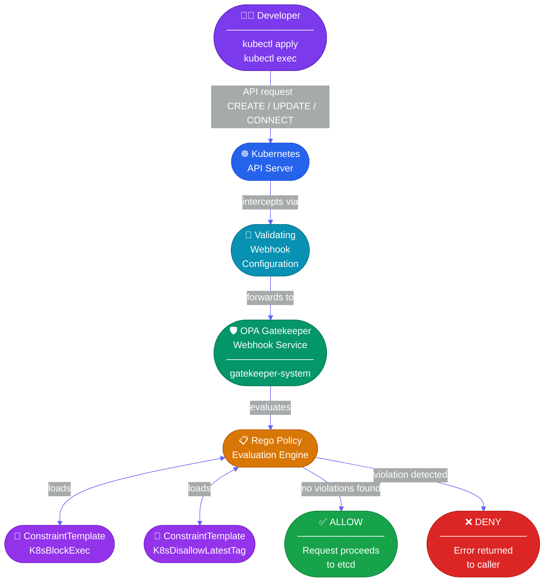
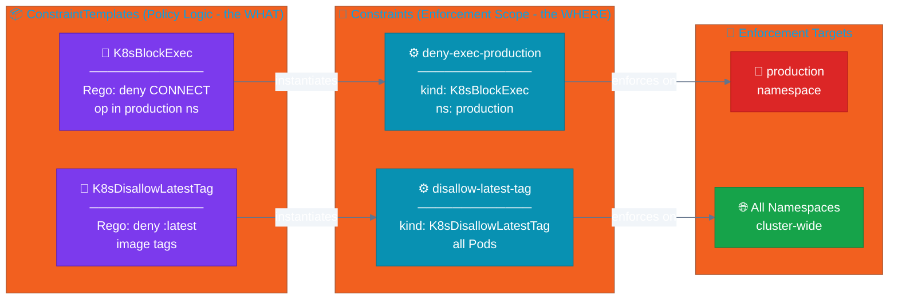

# 🛡️ OPA Gatekeeper GitOps Demo

Demonstrates enforcing Kubernetes admission policies using **OPA Gatekeeper** with manifests managed in Git. Two security policies are implemented as Rego rules and enforced via the Kubernetes Admission Webhook API:

| Policy | Scope |
|--------|-------|
| 🚫 Block `kubectl exec` | `production` namespace only |
| 🏷️ Deny `:latest` image tags | All Pods, cluster-wide |

---

## 🏗️ Architecture

### Admission Flow



---

### Resource Relationships



---

### GitOps Sync Pipeline

```mermaid
%%{init: {'theme': 'base', 'themeVariables': {'primaryColor': '#f59e0b', 'primaryTextColor': '#1c1917', 'primaryBorderColor': '#d97706', 'lineColor': '#92400e', 'secondaryColor': '#fff7ed'}}}%%
flowchart LR
    GIT(["🗂️ Git Repository\n─────────────\nYAML manifests\nversion controlled"])
    GITOPS(["🔄 GitOps Controller\n─────────────\nArgoCD or Flux\ncontinuous sync"])
    WAVE1(["🌊 Sync Wave 1\n─────────────\nConstraintTemplates\nregisters CRDs"])
    WAVE2(["🌊 Sync Wave 2\n─────────────\nConstraints\ninstantiate policies"])
    K8S(["☸️ Kubernetes\n─────────────\nPolicies active\nadmission enforced"])

    GIT -->|"  commit triggers  "| GITOPS
    GITOPS -->|"  applies first  "| WAVE1
    WAVE1 -->|"  CRDs ready  \n  then applies  "| WAVE2
    WAVE2 -->|"  policies live  "| K8S

    classDef gitStyle fill:#1e293b,stroke:#0f172a,color:#f8fafc
    classDef gitopsStyle fill:#7c3aed,stroke:#5b21b6,color:#fff
    classDef waveStyle fill:#0891b2,stroke:#0e7490,color:#fff
    classDef k8sStyle fill:#2563eb,stroke:#1d4ed8,color:#fff

    class GIT gitStyle
    class GITOPS gitopsStyle
    class WAVE1,WAVE2 waveStyle
    class K8S k8sStyle
```



---

## 📁 Repository Structure

```
gitops-opa/
├── gatekeeper-validating-webhook.yaml         # Webhook registration (with CONNECT op for exec blocking)
├── gatekeeper-constraint-blockexec.yaml       # ConstraintTemplate: K8sBlockExec
├── gatekeeper-podexec.yaml                    # Constraint: enforce exec-block in production
├── gatekeeper-constraint-deny-latest-tag.yaml # ConstraintTemplate: K8sDisallowLatestTag
├── gatekeeper-deny-latest-tag.yaml            # Constraint: enforce latest-tag denial on all Pods
└── pod-imglatest-tag.yaml                     # ⚠️ Test pod (nginx:latest) - expected to be REJECTED
```

---

## ✅ Prerequisites

- Kubernetes cluster **1.20+**
- `kubectl` configured and pointing at your target cluster
- Cluster-admin permissions

---

## 🚀 Installation

### 1. Install OPA Gatekeeper

```bash
kubectl apply -f https://raw.githubusercontent.com/open-policy-agent/gatekeeper/v3.22.2/deploy/gatekeeper.yaml
```

Wait for Gatekeeper to be ready:

```bash
kubectl rollout status deployment/gatekeeper-controller-manager -n gatekeeper-system
```

### 2. Create the `production` namespace

Required for the exec-block policy demo:

```bash
kubectl create namespace production
```

### 3. Apply Policies

> ⚠️ **Order matters.** ConstraintTemplates register CRDs - apply them first and wait before applying Constraints.

```bash
# Register the webhook (adds CONNECT operation support for exec blocking)
kubectl apply -f gatekeeper-validating-webhook.yaml

# Apply ConstraintTemplates first
kubectl apply -f gatekeeper-constraint-blockexec.yaml
kubectl apply -f gatekeeper-constraint-deny-latest-tag.yaml

# Then apply Constraints
kubectl apply -f gatekeeper-podexec.yaml
kubectl apply -f gatekeeper-deny-latest-tag.yaml
```

---

## 🎮 Demo Walkthrough

### 🏷️ Policy 1 - Deny `:latest` Image Tag

Apply the test pod - it uses `nginx:latest` and **should be rejected**:

```bash
kubectl apply -f pod-imglatest-tag.yaml
```

Expected output:
```
Error from server (Forbidden): error when creating "pod-imglatest-tag.yaml":
admission webhook "validation.gatekeeper.sh" denied the request:
Container 'nginx' uses the forbidden ':latest' tag (nginx:latest)
```

To verify the policy allows a pinned tag, edit the image to `nginx:1.27.0` and re-apply - it should succeed.

---

### 🚫 Policy 2 - Block `kubectl exec` in `production`

Run a pod in `production` and attempt to exec into it:

```bash
kubectl run test-pod --image=nginx:1.27.0 -n production
kubectl wait pod/test-pod -n production --for=condition=Ready --timeout=60s
kubectl exec -it test-pod -n production -- /bin/sh
```

Expected output:
```
Error from server (Forbidden): pods "test-pod" is forbidden:
kubectl exec is not allowed in namespace production
```

Exec **works normally** in other namespaces:

```bash
kubectl run test-pod --image=nginx:1.27.0 -n default
kubectl exec -it test-pod -n default -- /bin/sh  # ✅ succeeds
```

---

## 📋 Policy Reference

### `K8sBlockExec` - Rego

```rego
package k8sblockexec

violation[{"msg": msg}] {
  input.review.operation == "CONNECT"
  input.review.kind.kind == "PodExecOptions"
  input.review.namespace == "production"

  msg := sprintf("kubectl exec is not allowed in namespace %v", [input.review.namespace])
}
```

`kubectl exec` issues a `CONNECT` operation - not `CREATE` or `UPDATE`. The webhook must explicitly list `CONNECT` in its operations and include `pods/exec` as a resource. This is pre-configured in `gatekeeper-validating-webhook.yaml`.

---

### `K8sDisallowLatestTag` - Rego

```rego
package k8sdisallowlatesttag

violation[{"msg": msg}] {
  container := input.review.object.spec.containers[_]
  endswith(container.image, ":latest")
  msg := sprintf("Container '%v' uses the forbidden ':latest' tag (%v)", [container.name, container.image])
}

# Same check applied to initContainers and ephemeralContainers
```

Catches `:latest` across all three container types - `containers`, `initContainers`, and `ephemeralContainers`.

---

## ⚠️ Important Notes

### Webhook `CONNECT` Operation (exec blocking)
The standard Gatekeeper install does **not** intercept `CONNECT` operations. `gatekeeper-validating-webhook.yaml` patches this by adding `CONNECT` to the operations list and `pods/exec` to the resources. Without this, `K8sBlockExec` silently never fires.

The commented `kubectl patch` at the bottom of `gatekeeper-validating-webhook.yaml` is an alternative to applying the full webhook manifest - use it if you want to patch an existing Gatekeeper installation in-place.

### `failurePolicy: Ignore` on Main Webhook
The primary webhook (`validation.gatekeeper.sh`) uses `failurePolicy: Ignore`. If Gatekeeper is unavailable, API requests proceed unchecked - policies are not enforced. Consider switching to `failurePolicy: Fail` for production environments, but note that Gatekeeper downtime will block all cluster admission requests.

### `caBundle` Is Cluster-Specific
The `caBundle` values in the webhook configuration are TLS certificates tied to a specific cluster. Applying `gatekeeper-validating-webhook.yaml` to a **different cluster** will break webhook TLS verification. Let Gatekeeper manage its own certificates instead:

```bash
# Remove the manually applied webhook and let Gatekeeper recreate it with correct certs
kubectl delete validatingwebhookconfiguration gatekeeper-validating-webhook-configuration
kubectl rollout restart deployment/gatekeeper-controller-manager -n gatekeeper-system
```

---

## 🔄 GitOps Usage

These manifests are controller-agnostic. Point your GitOps tool at this directory:

**ArgoCD** - use sync waves to enforce apply order:
```yaml
apiVersion: argoproj.io/v1alpha1
kind: Application
spec:
  source:
    repoURL: <your-repo>
    path: gitops-opa
    targetRevision: HEAD
```

Add sync wave annotations to guarantee ConstraintTemplates apply before Constraints:
```yaml
# On ConstraintTemplates
metadata:
  annotations:
    argocd.argoproj.io/sync-wave: "1"

# On Constraints
metadata:
  annotations:
    argocd.argoproj.io/sync-wave: "2"
```

**Flux** - use `dependsOn` to sequence:
```yaml
apiVersion: kustomize.toolkit.fluxcd.io/v1
kind: Kustomization
metadata:
  name: gatekeeper-policies
spec:
  path: ./gitops-opa
  interval: 5m
```

---

## 🧹 Cleanup

Remove policies in reverse order (Constraints before ConstraintTemplates):

```bash
kubectl delete -f gatekeeper-deny-latest-tag.yaml
kubectl delete -f gatekeeper-podexec.yaml
kubectl delete -f gatekeeper-constraint-deny-latest-tag.yaml
kubectl delete -f gatekeeper-constraint-blockexec.yaml
```

To fully uninstall Gatekeeper:

```bash
kubectl delete -f https://raw.githubusercontent.com/open-policy-agent/gatekeeper/v3.22.2/deploy/gatekeeper.yaml
```

---

## 📚 References

- [OPA Gatekeeper Docs](https://open-policy-agent.github.io/gatekeeper/website/docs/)
- [Rego Policy Language](https://www.openpolicyagent.org/docs/latest/policy-language/)
- [Kubernetes Admission Webhooks](https://kubernetes.io/docs/reference/access-authn-authz/extensible-admission-controllers/)
- [Gatekeeper v3.22.2 Release](https://github.com/open-policy-agent/gatekeeper/releases/tag/v3.22.2)
