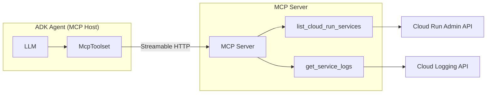
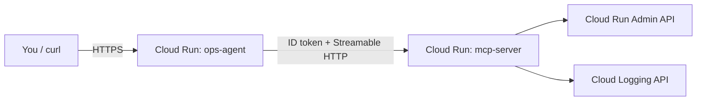

# Workshop 3: MCP Servers - Build a Cloud Run Fleet Assistant

**Level:** Advanced | **Duration:** ~120-130 min | **Env:** Google Cloud Shell

## What you'll build

A **Cloud Run Fleet Assistant**: an ADK agent that answers questions like
"what services are deployed?" and "show me recent errors for my-service" by
calling tools that live in a completely separate **MCP server** - not baked
into the agent's own code. Deploy both pieces to Cloud Run as two
independent services talking to each other over an authenticated HTTP
connection.

Solution code already lives in [`../cloud_run_mcp_server/`](../cloud_run_mcp_server/agent.py)
and [`../ops_agent/`](../ops_agent/agent.py) - try building it yourself
first, peek only if stuck.

## Learning objectives

By the end you'll be able to:
- Explain what MCP (Model Context Protocol) is and why it decouples tools from any one agent
- Build an MCP server with the `mcp` Python SDK and expose it over Streamable HTTP
- Connect an ADK agent to an MCP server with `McpToolset`
- Deploy two Cloud Run services that talk to each other with ID-token authentication instead of a shared secret
- Explain why a tool that reads production data should be read-only and access-scoped by default

## Prerequisites

Finish [Workshop 1](../workshop-1-agent-tools/README.md) first (or at least
the one-time environment setup) - `adk --version` should already work and
your Gemini backend should already be exported. Ideally you also still have
a service deployed from Workshop 1 or 2, since this agent queries it for real.

```bash
pip install mcp google-cloud-run google-cloud-logging google-auth
gcloud services enable run.googleapis.com logging.googleapis.com
```

> `run.googleapis.com` was already enabled in Workshop 1 for deploying
> agents - here it's also used to *read* service metadata
> (`roles/run.viewer`), a different permission from the one that deploys.

---

## What is MCP (and why your agent needs it)

In Workshop 1, a "tool" was a Python function living directly inside
`agent.py` - useful, but it only exists for that one agent, in that one
codebase. **MCP** is an open standard that moves tools into their own
standalone server, so any MCP-compatible client can discover and call them
the same way, over the same protocol.



| | Workshop 1 custom tool | This workshop's MCP tool |
|---|---|---|
| Lives in | The agent's own `agent.py` | A separate server process/service |
| Reusable across agents? | No - copy-paste only | Yes - any MCP client can connect |
| Transport | Direct Python function call | stdio (local) or HTTP (remote) |
| Deployment | Ships with the agent | Its own Cloud Run service, own IAM |

---

## Part A - Build the MCP server

Open [`../cloud_run_mcp_server/server.py`](../cloud_run_mcp_server/server.py):

```python
from mcp.server.mcpserver import MCPServer
from google.cloud import run_v2

mcp = MCPServer("cloud-run-ops")

@mcp.tool()
def list_cloud_run_services(region: str = "us-central1") -> dict:
    """List Cloud Run services currently deployed in this project and region."""
    ...
```

> As of late 2026, the `mcp` Python SDK's high-level server class is
> `MCPServer` from `mcp.server.mcpserver` - an older SDK version called this
> `FastMCP`. Check which one you're on with `pip show mcp`.

Both tools (`list_cloud_run_services`, `get_service_logs`) follow the same
`status`/`error_message` contract as every other tool in this repo.
`host`/`port` are passed to `mcp.run(...)`, not the constructor - Cloud Run
injects the listen port via `$PORT`, and the server must respect it:

```python
if __name__ == "__main__":
    mcp.run(transport="streamable-http", host="0.0.0.0", port=int(os.environ.get("PORT", 8080)))
```

**Test it standalone, before any agent exists:**

```bash
export GOOGLE_CLOUD_PROJECT=$(gcloud config get-value project)
cd cloud_run_mcp_server
pip install -r requirements.txt
python server.py
```

```bash
npx @modelcontextprotocol/inspector http://localhost:8080/mcp
```

Click **List Tools**, confirm both tools show up, then run
`list_cloud_run_services` directly and confirm you get real data back.

---

## Part B - Connect an ADK agent to it

Open [`../ops_agent/agent.py`](../ops_agent/agent.py):

```python
from google.adk.tools.mcp_tool.mcp_toolset import McpToolset
from google.adk.tools.mcp_tool.mcp_session_manager import StreamableHTTPServerParams

fleet_tools = McpToolset(
    connection_params=StreamableHTTPServerParams(url=MCP_SERVER_URL),
)

root_agent = Agent(
    model=MODEL,
    name="cloud_run_ops_agent",
    description="Answers questions about the Cloud Run services deployed in this project.",
    instruction="...",
    tools=[fleet_tools],
)
```

> `google-adk` recently renamed `MCPToolset` to `McpToolset` (the old name
> still works but is deprecated). If neither exists in your installed
> version, run `python -c "from google.adk.tools.mcp_tool import mcp_toolset as m; print(dir(m))"`
> to see what's actually available.

`tools=[fleet_tools]` takes the whole toolset, not individual functions -
ADK expands it into every tool the server advertises at connection time.

**Run both locally**, two terminal tabs:

```bash
# Tab 1
export GOOGLE_CLOUD_PROJECT=$(gcloud config get-value project)
cd cloud_run_mcp_server && python server.py

# Tab 2
export MCP_SERVER_URL="http://localhost:8080/mcp"
adk web
```

Pick `ops_agent` and ask: *"What Cloud Run services are deployed in this project?"*

---

## Part C - Deploy the MCP server to Cloud Run

Deployed **without** `--allow-unauthenticated` on purpose:

```bash
cd cloud_run_mcp_server

gcloud run deploy mcp-server \
  --source . \
  --region=us-central1 \
  --no-allow-unauthenticated \
  --set-env-vars=GOOGLE_CLOUD_PROJECT=$(gcloud config get-value project)

PROJECT_NUMBER=$(gcloud projects describe $(gcloud config get-value project) --format='value(projectNumber)')
SERVICE_ACCOUNT="${PROJECT_NUMBER}-compute@developer.gserviceaccount.com"

gcloud projects add-iam-policy-binding $(gcloud config get-value project) \
  --member="serviceAccount:${SERVICE_ACCOUNT}" --role="roles/run.viewer"
gcloud projects add-iam-policy-binding $(gcloud config get-value project) \
  --member="serviceAccount:${SERVICE_ACCOUNT}" --role="roles/logging.viewer"
```

---

## Part D - Authenticate service-to-service



`ops_agent/agent.py` mints a Google-signed ID token scoped to the MCP
server's URL and sends it as the `Authorization` header - skipped entirely
for a `localhost` URL, so local dev needs no auth setup:

```python
def _mcp_connection_headers(url: str) -> dict:
    if url.startswith("http://localhost") or url.startswith("http://127.0.0.1"):
        return {}
    auth_request = google.auth.transport.requests.Request()
    token = google.oauth2.id_token.fetch_id_token(auth_request, url.rsplit("/mcp", 1)[0])
    return {"Authorization": f"Bearer {token}"}
```

> ID tokens expire after about an hour. Minting one at import time is fine
> for a workshop, but a long-running production agent should refresh per
> request instead of once at startup.

Grant your own account (for local testing) and the agent's runtime service
account (for the deployed version) `roles/run.invoker` on `mcp-server`:

```bash
gcloud auth application-default login

gcloud run services add-iam-policy-binding mcp-server \
  --region=us-central1 \
  --member="user:$(gcloud config get-value account)" \
  --role="roles/run.invoker"
```

---

## Part E - Deploy the agent and talk to it

```bash
cd ../ops_agent

adk deploy cloud_run ops_agent -- \
  --region=us-central1 \
  --set-env-vars=MCP_SERVER_URL="https://mcp-server-XXXXXXXXXX.us-central1.run.app/mcp",GOOGLE_API_KEY=YOUR_GEMINI_API_KEY,GOOGLE_GENAI_USE_VERTEXAI=FALSE

gcloud run services add-iam-policy-binding mcp-server \
  --region=us-central1 \
  --member="serviceAccount:${SERVICE_ACCOUNT}" \
  --role="roles/run.invoker"
```

```bash
export SERVICE_URL="https://adk-default-service-name-XXXXXXXXXX.us-central1.run.app"

curl -X POST "$SERVICE_URL/apps/ops_agent/users/u_123/sessions/s_1" \
  -H "Content-Type: application/json" -d '{}'

curl -X POST "$SERVICE_URL/run" \
  -H "Content-Type: application/json" \
  -d '{
    "appName": "ops_agent",
    "userId": "u_123",
    "sessionId": "s_1",
    "newMessage": {"role": "user", "parts": [{"text": "What Cloud Run services are deployed?"}]}
  }'
```

---

## Troubleshoot

- **403 from the MCP server:** the caller's identity is missing `roles/run.invoker` on `mcp-server`.
- **Empty tool list:** confirm `MCP_SERVER_URL` includes the trailing `/mcp` path.
- **401 after running a while:** the ID token expired - see the refresh-per-request note above.

## Design principle: read-only tools by default

Both tools here only *read* data - no `delete_service`/`restart_service`
exposed over MCP, on purpose. A server reachable by any authenticated MCP
client is a wider blast radius than a tool buried in one agent's own code.
Keep destructive operations out of a shared tool server, or gate them
behind an explicit human-approval step.

## Clean up

```bash
gcloud run services delete adk-default-service-name --region=us-central1
gcloud run services delete mcp-server --region=us-central1
```

## Recap

- **MCP** moves tools out of any one agent's codebase into a standalone server that speaks a shared protocol.
- `McpToolset` connects an ADK agent to that server over stdio (local) or Streamable HTTP (remote).
- Test an MCP server on its own with the MCP Inspector before ever wiring up an agent.
- Two Cloud Run services authenticate to each other with ID tokens and `roles/run.invoker`, not an open endpoint or a shared secret.

**Resources:** [Google ADK MCP tools docs](https://google.github.io/adk-docs/tools/mcp-tools/) · [Model Context Protocol spec](https://modelcontextprotocol.io/)
