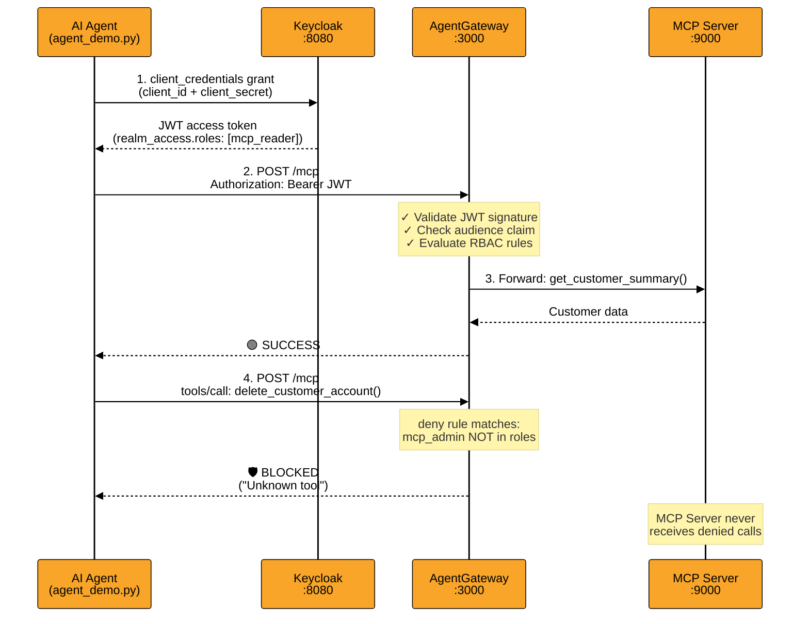

# Securing MCP Servers with Keycloak + AgentGateway

A runnable demo showing how to enforce **OAuth2-based, tool-level authorization** on an MCP server using Keycloak as the identity provider and AgentGateway as the enforcement point.

---

## Architecture



**Key security insight**: AgentGateway enforces authorization *before* the MCP server ever sees the request. The server has no auth logic of its own — the gateway is the enforcement point.

---

## Prerequisites

| Dependency | Version | Notes |
|---|---|---|
| Docker | any | runs Keycloak |
| AgentGateway | 1.3.1 | at `/usr/local/bin/agentgateway` |
| Python venv | 3.14 | `mcp`, `fastmcp`, `httpx` |

---

## Files

| File | Purpose |
|---|---|
| `server.py` | FastMCP server — two tools, no auth logic |
| `config.yaml` | AgentGateway config — Keycloak JWKS + RBAC rules |
| `agent_demo.py` | Demo agent — accepts `--client-id` / `--client-secret` |
| `setup_keycloak.sh` | Creates realm, roles, clients via Keycloak REST API |
| `start.sh` | **Start here** — boots infrastructure, prints credentials |
| `e2e.sh` | Automated validation — run before presenting |

---

## Quick Start

### Step 1 — Start infrastructure

```bash
bash start.sh
```

Boots Keycloak, MCP server, and AgentGateway. Configures the realm automatically. Prints credentials when ready.

Use `--keep` to reuse an existing Keycloak container (faster restarts):
```bash
bash start.sh --keep
```

### Step 2 — Run the agent (new terminal)

Copy the commands printed by `start.sh`. Or manually:

**READER** — gets BLOCKED on delete:
```bash
python3 agent_demo.py \
  --client-id agent-core-client \
  --client-secret <printed-by-start.sh>
```

**ADMIN** — delete is ALLOWED (the mic-drop moment):
```bash
python3 agent_demo.py \
  --client-id adminuser \
  --client-secret <printed-by-start.sh>
```

Credentials can also be passed via env vars:
```bash
export CLIENT_ID=agent-core-client
export CLIENT_SECRET=<secret>
python3 agent_demo.py
```

---

## Pre-presentation Validation

Run this before going on stage to confirm everything works:

```bash
bash e2e.sh
```

Runs all 3 scenarios automatically (reader blocked, admin allowed, bad credentials rejected) and prints a pass/fail report. Returns exit code 0 on success. Add `--keep` to skip re-creating Keycloak.

---

## Keycloak Configuration

The `setup_keycloak.sh` script automates all manual steps:

| Step | What it creates |
|---|---|
| Realm | `ai-mesh` |
| Realm roles | `mcp_reader`, `mcp_admin` |
| Client `agent-core-client` | service-account with `mcp_reader` |
| Client `adminuser` | service-account with `mcp_admin` |
| Audience mapper | adds `account` to `aud` claim (required by gateway) |

**Keycloak Admin UI**: http://localhost:8080 — `admin` / `admin`

---

## Authorization Rules

Defined in `config.yaml` under `mcpAuthorization`:

```yaml
mcpAuthorization:
  rules:
    - deny: 'mcp.tool.name == "delete_customer_account" && !("mcp_admin" in jwt.realm_access.roles)'
```

**Default behavior**: allow-unless-denied. Any tool not matched by a deny rule is allowed.

| Token role | `get_customer_summary` | `delete_customer_account` |
|---|---|---|
| `mcp_reader` | ✅ Allowed | 🛡️ Blocked ("Unknown tool") |
| `mcp_admin` | ✅ Allowed | ✅ Allowed |
| No token | 401 Unauthorized | 401 Unauthorized |

> **Why "Unknown tool" instead of "403 Forbidden"?**  
> AgentGateway deliberately hides blocked tools as "unknown" — the agent cannot even discover they exist, preventing tool enumeration.

---

## MCP Server Tools

```python
@mcp.tool()
def get_customer_summary(customer_id: str) -> str:
    """Safe read — available to all authenticated agents."""

@mcp.tool()
def delete_customer_account(customer_id: str) -> str:
    """Destructive — requires mcp_admin role (enforced at gateway)."""
```

---

## Troubleshooting

| Symptom | Cause | Fix |
|---|---|---|
| `401 Unauthorized` | Token not accepted | Check `audiences: [account]` in config.yaml; verify audience mapper exists in Keycloak |
| `AgentGateway failed to start` | Keycloak not ready when gateway starts | Re-run `start.sh`; check `cat agentgateway.log` |
| MCP server not responding | Port 9000 already in use | `pkill -f server.py && bash start.sh` |
| Secret invalid after restart | `start.sh` re-ran setup and rotated secrets | Use `start.sh --keep` to reuse existing config |
| `ClosedResourceError` tracebacks | MCP SDK internal noise | Suppressed via `logging.getLogger("mcp").setLevel(CRITICAL)` |
